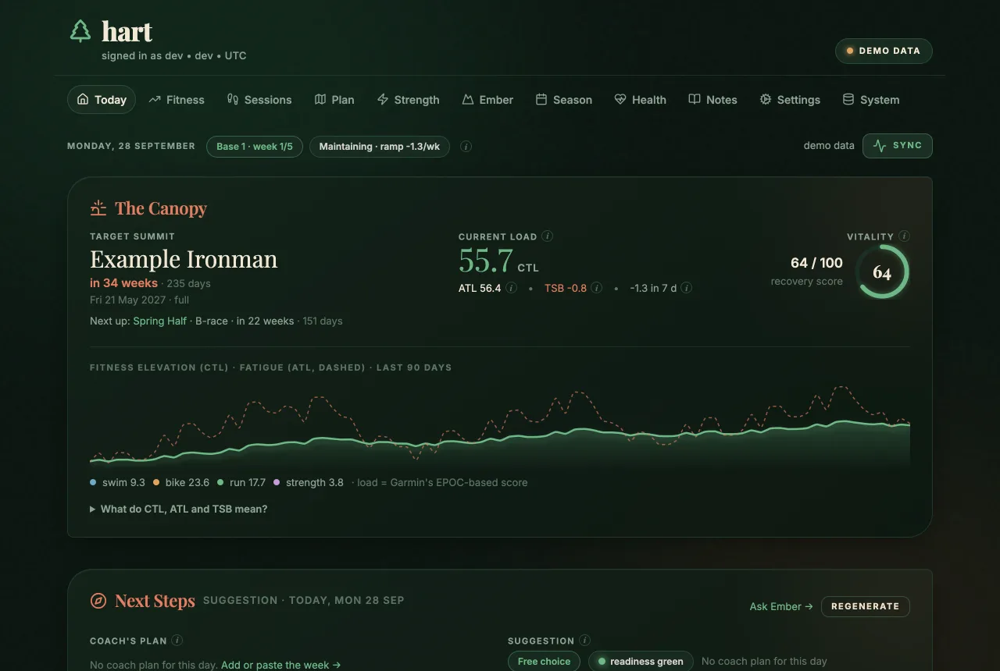
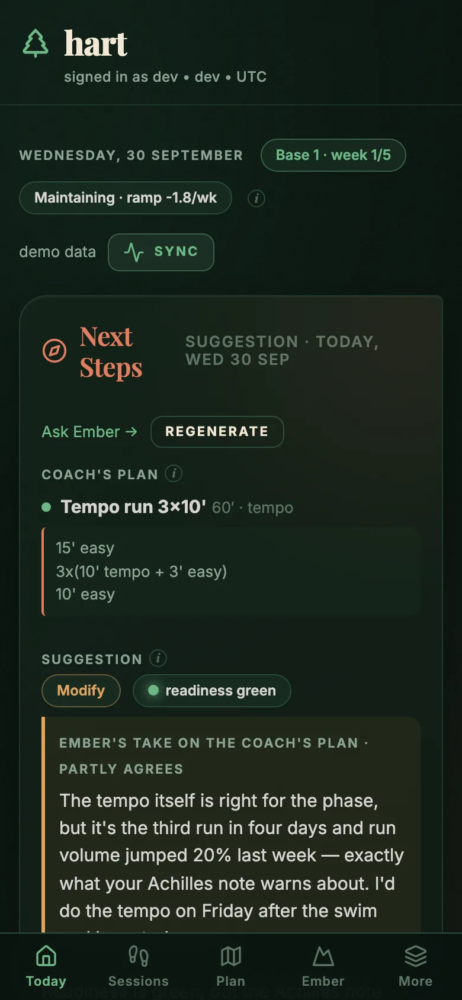
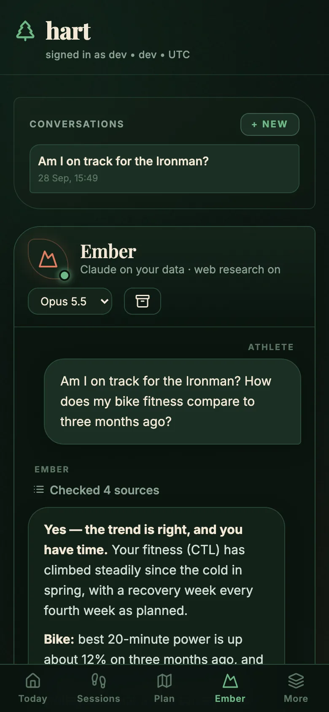
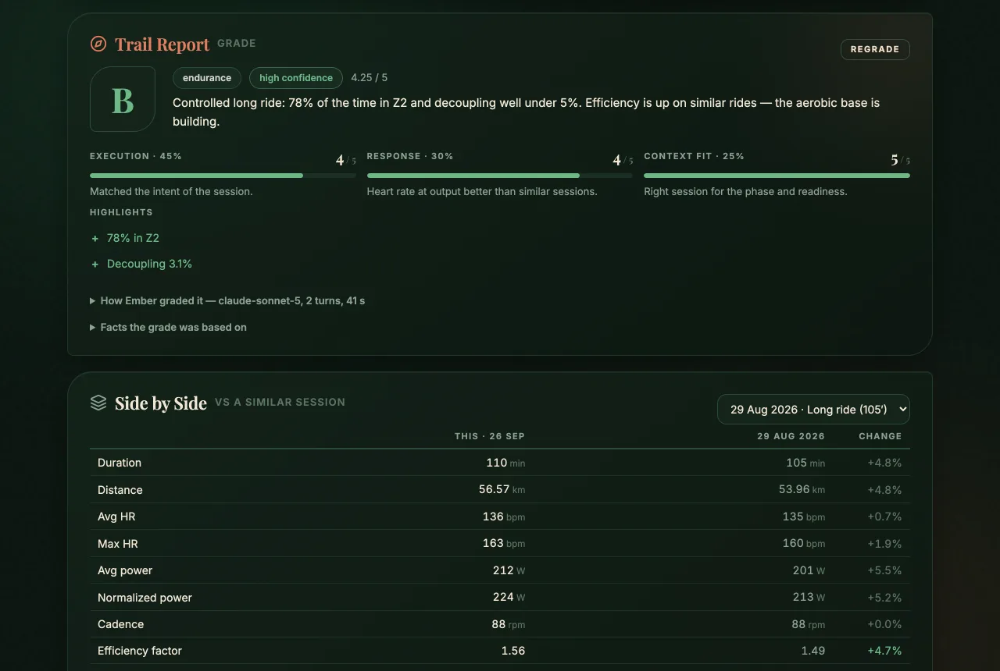
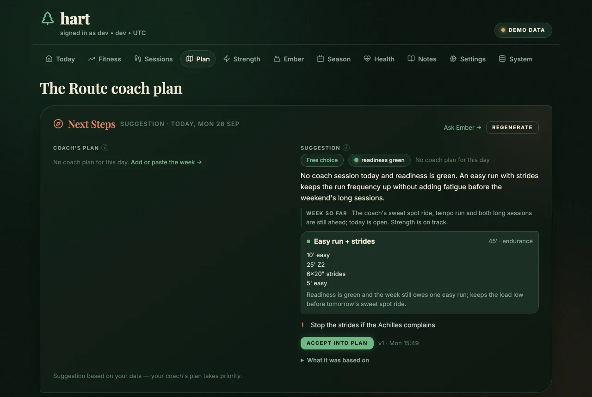
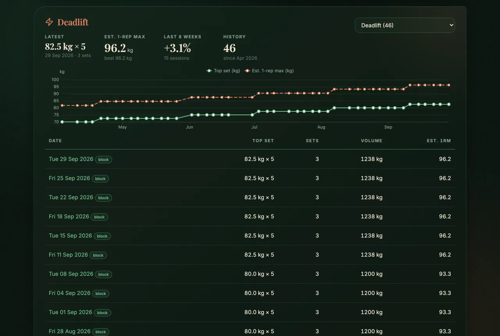
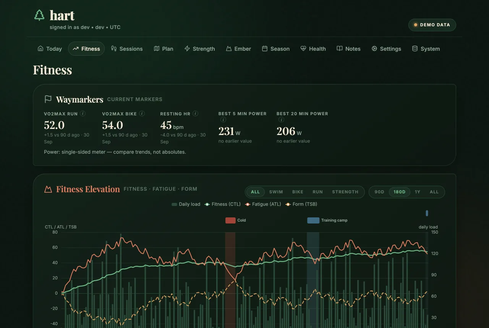
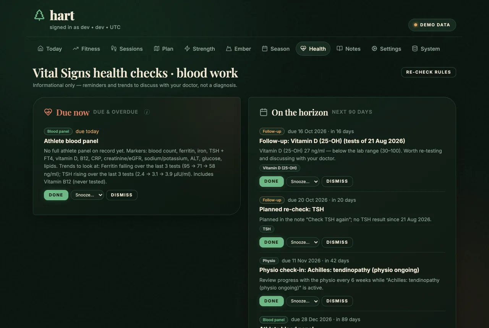

<p align="center">
  
</p>

<h1 align="center">hart</h1>

<p align="center"><strong>A self-hosted training companion for endurance athletes.</strong></p>

hart syncs your Garmin data, turns it into
training load, readiness and trends, grades every session, suggests the next day's training around your
coach's plan — and gives you **Ember**, an AI coach-analyst that answers questions about your own data,
running on your existing Claude subscription.

It's a single Python service with a web UI (installable on your phone), a CLI, and an MCP server, built to
run on a home server behind [Tailscale](https://tailscale.com) (or any reverse proxy that authenticates
you). Your data stays in one DuckDB file on your machine.

> hart is a personal project, built for one athlete's triathlon training and shared as-is. It works for
> running, cycling, swimming and strength; it isn't medical advice and doesn't replace a coach.



<p align="center">
  
  &nbsp;&nbsp;
  
</p>

<sub>Screenshots use the fictional demo athlete from <code>hart demo</code>.</sub>

## What it does

| | |
|---|---|
| **Today** | Readiness from sleep, HRV and resting HR against your own baselines — and an explanation when it can't tell; fitness (CTL), fatigue (ATL) and form; the week so far; the day's suggestion; alerts. |
| **Fitness** | Performance-management chart with season phases, weekly volume, efficiency and decoupling, power curve, health trends, period comparison. |
| **Season** | Phases (comeback → base → build → peak → taper), generated backwards from your A-race and editable; races and events; the observed training state vs the plan. |
| **Plan** | Your coach's sessions (paste them from a coaching app, an email or a message — any format, any language), matched to what you did; accepted suggestions; one click sends a run or ride to your Garmin calendar as a structured workout. |
| **Sessions** | Every session graded A–E by Ember from facts computed in code, with every number checked against your data; side-by-side with a similar earlier session. |
| **Strength** | Progression per lift (top sets, estimated 1-rep max, 8-week change), sessions per week against your target; lifts Garmin names differently can be merged ("Barbell Deadlift" = "Deadlift"). |
| **Health** | Lab results with trends, and reminders computed from them: follow-ups on flagged results, regular panels timed to your season, a pre-race medical, physio check-ins. |
| **Ember** | Chat with an AI coach-analyst that reads your data through hart's tools, never invents numbers, and proposes changes (notes, plan, season, health checks) that you approve. |
| **Evening message** | Tomorrow's plan and suggestion, today's sessions and open alerts, in Discord at the time you choose. |

| Session grade and side-by-side | Daily suggestion around the coach's plan |
|---|---|
|  |  |
| **Strength progression** | **Fitness, fatigue and form over the season** |
|  |  |
| **Health checks from lab results** | |
|  | |

**Suggestions follow hard rules.** Code, not the model, checks every suggestion: no hard sessions on a red
readiness day, the limits in your notes ("swim only on Thursday", weekly strength sessions), comeback
duration caps and your coach's plan. A suggestion that breaks one is repaired or not shown.

**The AI runs on your Claude subscription.** hart drives [Claude Code](https://docs.claude.com/en/docs/claude-code/overview)
through the Claude Agent SDK with a token from `claude setup-token` — no API key and no per-token bill. Claude only
sees your data through hart's read tools, can't touch files or run commands, and web search (optional,
per chat) is filtered so your data never leaves in a query. See [docs/security.md](docs/security.md).

## Try it with demo data

No Garmin account needed — `hart demo` creates a database with six months of a fictional athlete's training,
health, strength and lab data (syncs and Claude stay off for it):

```bash
git clone https://github.com/louqash/hart.git && cd hart
uv sync
uv run hart demo
HART_ENV=dev HART_DB_PATH=data/demo.duckdb uv run hart serve   # http://127.0.0.1:8765
```

## Quick start

You need Python 3.12+, [uv](https://docs.astral.sh/uv/), a Garmin Connect account and (for Ember) a Claude
subscription with [Claude Code](https://docs.claude.com/en/docs/claude-code/setup) installed on your laptop.

```bash
git clone https://github.com/louqash/hart.git && cd hart
uv sync --extra dev
cp .env.example .env          # add GARMIN_EMAIL / GARMIN_PASSWORD, HART_TZ, HART_ATHLETE_NAME
uv run hart-init-db
uv run --extra auth playwright install chromium   # browser for the Garmin login (once)
uv run --extra auth hart auth # one-time Garmin login in a browser
uv run hart sync all          # pull the last 14 days
HART_ENV=dev uv run hart serve
```

Open <http://127.0.0.1:8765>. `HART_ENV=dev` skips sign-in and only listens on 127.0.0.1 — for trying it
out on your own machine. For Ember, add `CLAUDE_CODE_OAUTH_TOKEN` (from `claude setup-token`) to `.env`.

To run it for real — on a home server, reachable from your phone — see [docs/deployment.md](docs/deployment.md)
(Docker + Tailscale Serve in about ten minutes).

**Tell it about yourself.** Ember and the suggestions know only what you tell hart: add notes on the
Notes page (goals, injuries, constraints, baselines) or start from the files in [`examples/seed`](examples/seed),
and set your name, coach platform and power meter on the Settings page.

## Documentation

- [Deployment](docs/deployment.md) — Docker, Tailscale Serve or another proxy, backups, updates, token renewal
- [Configuration](docs/configuration.md) — every environment variable and setting, seed files, note rules
- [Architecture](docs/architecture.md) — how the pieces fit: sync pipeline, jobs, Ember, grading, suggestions
- [Security & privacy](docs/security.md) — sign-in, what Claude can and can't do, what leaves your server
- [Development](docs/development.md) — local setup, tests, project layout

## Using hart from Claude Code

hart is also an MCP server (42 tools: activities, streams, load, sleep, HRV, readiness, plan, grades, labs,
SQL…). The repository's `.mcp.json` starts it locally over stdio; when the web service runs, point Claude Code
at its `/mcp` endpoint instead (the database can only be opened by one process):

```bash
claude mcp add --transport http hart https://hart.<your-tailnet>.ts.net/mcp
```

Ready-made subagents are in `.claude/agents`: recovery, training load, performance, anomalies, nutrition,
race prediction and race strategy, plus morning, post-session and weekly briefings that post to Discord. They
inherit all hart tools and run only when you ask for them (the server's own scheduled message is the evening
summary).

## Status

Built and used daily by one athlete; shared in case it's useful to someone else. Issues and pull requests are
welcome, but there's no roadmap or support promise. Garmin Connect has no official API for this — hart uses
the community [`garminconnect`](https://github.com/cyberjunky/python-garminconnect) library, which can break
when Garmin changes things.

## License

[MIT](LICENSE). Third-party assets (ECharts, Lucide icons, Inter and Playfair Display fonts) keep their own
licenses — see [THIRD_PARTY_NOTICES.md](THIRD_PARTY_NOTICES.md).
