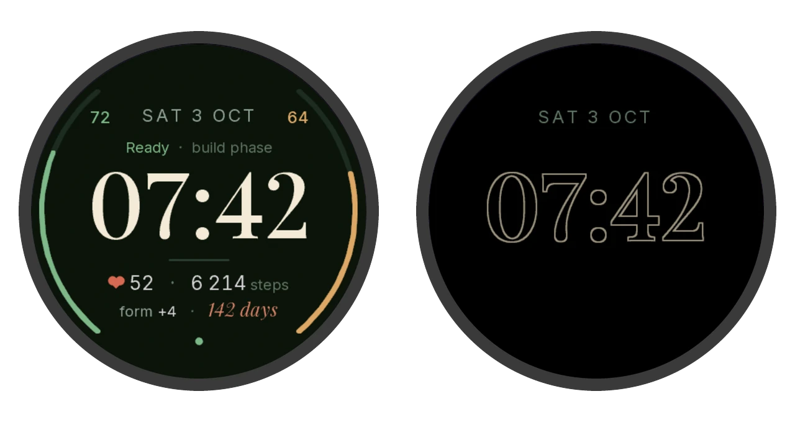

# hart watch face



A Connect IQ watch face for the Forerunner 965 in the hart web UI's style: Playfair Display time,
Body Battery and watch-battery arcs, heart rate and steps. In always-on mode it
draws outlined digits in the same place as the active face, drifting by 2px each minute
(AMOLED burn-in rules).

With a hart address built in, it also shows hart's readiness, training phase and form (TSB), and
counts down to hart's next A-race. Without one it shows on-watch data only.

## hart data

Every 15 minutes a background service requests `GET <hart address>/api/watch` through the Garmin
Connect app on the phone, so the request rides the phone's Tailscale connection to the server.
The reply is about 100 bytes:

```json
{"date": "2026-10-03", "ready": "amber", "phase": "base", "week": 1, "form": 5, "race": "2027-05-26"}
```

- **Sign-in:** none of its own. Tailscale Serve adds the identity header for requests from your
  own devices, the phone included, so hart's normal check applies (docs/security.md).
- **HTTPS is required** by Connect IQ (error `-1001` otherwise), which the `ts.net` address gives.
  The simulator enforces it too, so it can't fetch from a plain-http dev server.
- **Stale data:** the face keeps the last good reply. If it isn't today's or is over three hours
  old (Tailscale off on the phone, server down), the readiness word and form turn grey and the dot
  under them goes from green to grey.
- After installing, the first fetch runs straight away (or 5 minutes after the last background
  run, the watch's minimum gap); after that, every 15 minutes.

### When hart data doesn't appear

Until the first good reply, the bottom line of the face says what happened:

| Shown | Meaning | Check |
|---|---|---|
| `hart: waiting` | No fetch has finished yet | Wait up to 5 minutes after installing; the watch must be connected to the phone |
| nothing | The build has no hart address | Build with `local.jungle` (above) |
| `error -104` | Watch can't reach the phone over Bluetooth | Garmin Connect running and connected on the phone |
| `error -2`, `-300` | Phone didn't get an answer in time | Tailscale on in the phone, and Garmin Connect not excluded from it (Android: app split tunnelling) |
| `error -1001` | Address isn't HTTPS | Use the `https://…ts.net` address |
| `error 403` | hart refused the request | Phone is a Tailscale device of yours (not tagged or shared); `HART_ALLOWED_USERS` includes you |
| `error 404` | Server doesn't have `/api/watch` | Deploy the current hart version |

To test the phone's side by itself, open `<hart address>/api/watch` in the phone's browser with
Tailscale on. It should show the JSON above. Once data has arrived, a later failure greys the values
and puts the code in place of the training phase.

## Build

Needs the Connect IQ SDK (SDK Manager) and a developer key at `hart-watchface/developer_key`
(gitignored — keep a backup; sideloaded builds must be signed with the same key to update).

```bash
SDK="$(cat ~/Library/Application\ Support/Garmin/ConnectIQ/current-sdk.cfg)"
"$SDK/bin/monkeyc" -f "monkey.jungle;local.jungle" -d fr965 -y developer_key -o bin/hart.prg
"$SDK/bin/connectiq" &                     # simulator
"$SDK/bin/monkeydo" bin/hart.prg fr965
```

The simulator keeps stored hart data between runs; clear it under File → Edit Persistent Storage.

## Install

Connect the watch over USB and copy `bin/hart.prg` to `GARMIN/APPS/` (on macOS use OpenMTP or
Android File Transfer). Then pick **hart** under Watch Face on the watch.

## hart address

A face copied over USB gets no settings page in Garmin Connect or the Connect IQ app (only
store-installed apps do), so the address is compiled in rather than a setting. That also means a
reinstall always replaces it; a stored setting could survive from an earlier build. Two
gitignored files hold it:

`local.jungle`:

```
base.resourcePath = resources;resources-local
```

`resources-local/strings.xml`:

```xml
<strings>
    <string id="HartUrl" scope="background">https://hart.your-tailnet.ts.net</string>
</strings>
```

Leave out the trailing slash. Without these files, build with `-f monkey.jungle` and the face
shows on-watch data only.

The countdown comes from hart's next A-race (or next race of any priority), so it's hidden until
the first hart reply arrives, and when no race is planned.

## Fonts and icon

`resources/fonts/*` and `resources/drawables/launcher_icon.png` are generated from the web UI's
fonts by `tools/make_assets.py` (command in its docstring).
